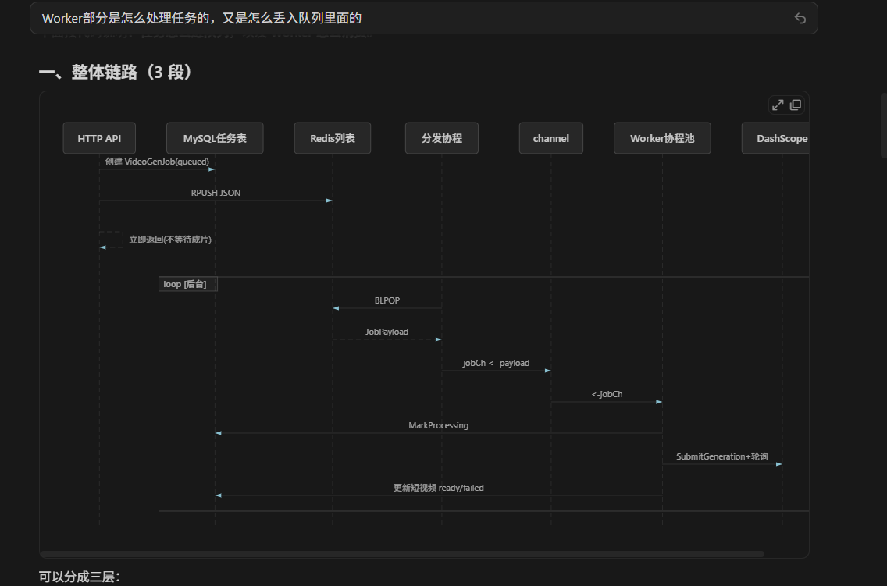
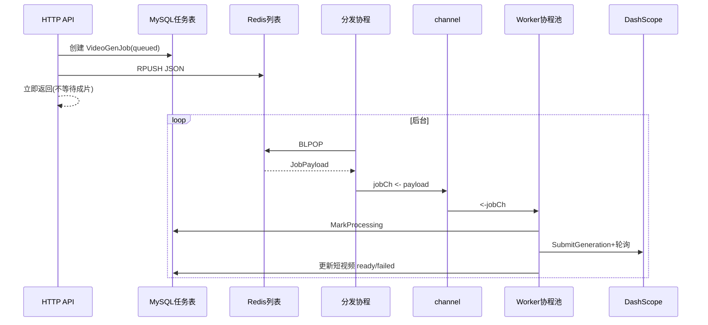

# 短视频异步成片：Worker 与队列说明

本文档说明 `video-async` 模块中**任务如何入队**、**Worker 如何消费**，便于后续维护与扩容。

相关代码目录：

- `server/service/videoasync/` — Redis 队列 + channel + Worker 池
- `server/service/content/video_generation_exec.go` — 入队与执行成片
- `server/initialize/video_async.go` — 启动时注册 Processor
- `server/model/content/video_gen_job.go` — 任务表 `content_video_gen_jobs`

---

## 一、整体链路（3 段）


```
HTTP API 入队
    → MySQL 写任务表 (queued)
    → Redis RPUSH
    → API 立即返回（不等待 DashScope）

后台常驻：
    分发协程 BLPOP Redis
    → 写入 Go channel (jobCh)
    → Worker 协程池从 channel 取任务
    → ExecuteVideoGeneration（DashScope 提交 + 轮询）
    → 更新任务表 + 短视频状态 (ready/failed)
```



三层职责：

| 层级 | 组件 | 作用 |
|------|------|------|
| 入队层 | HTTP 请求内 | 写 DB + 推 Redis，马上返回 |
| 分发层 | 1 个 `redisDispatcher` goroutine | Redis `BLPOP` → 写入 `channel` |
| 执行层 | N 个 `workerLoop` goroutine | 从 `channel` 取任务 → 调 DashScope |

---

## 二、任务是怎么丢进队列的？

### 2.1 入口

后台「生成成片」「入库并自动生成」等，最终调用：

`ShortVideoService.RunVideoGeneration(id)`

- `video-async.enabled: true` → 调用 `EnqueueVideoGeneration`（只入队）
- `video-async.enabled: false` → 调用 `ExecuteVideoGeneration`（同步，阻塞到成片结束）

文件：`server/service/content/content_short_video.go`

### 2.2 入队步骤（EnqueueVideoGeneration）

文件：`server/service/content/video_generation_exec.go`

1. **校验**：脚本非空、无进行中的任务、已配置 `dashscope-video` 或 `volc-ark-video`
2. **写任务表**：`content_video_gen_jobs`，`status = queued`
3. **更新短视频**：`content_short_videos.status = queued`
4. **推队列**：`enqueueVideoJob` → `videoasync.Enqueue`

### 2.3 写入 Redis

文件：`server/service/videoasync/queue.go`

- 命令：`RPUSH` 到列表 key（默认 `gva:video:gen:queue`）
- 消息体 JSON：

```json
{"jobId": 12, "shortVideoId": 5}
```

结构体：`videoasync.JobPayload`（`server/service/videoasync/types.go`）

桥接：`server/service/content/video_async_bridge.go` 调用 `videoasync.Default().Enqueue`。

### 2.4 无 Redis 时的降级

若 `require-redis: false` 且未开 `system.use-redis`：

- 不入 Redis，直接 `jobCh <- payload`（仅内存 channel）
- 服务重启后队列丢失，**仅适合开发调试**

---

## 三、Worker 是怎么处理任务的？

### 3.1 服务启动

`server/core/server.go` 在 Redis 初始化后调用 `initialize.VideoAsyncWorker()`。

文件：`server/initialize/video_async.go`

1. `RegisterProcessor`：注册 `content.ExecuteVideoGeneration` 为实际执行函数（避免包循环依赖）
2. `videoasync.Default().Start()`：启动分发协程 + Worker 池

### 3.2 Start() 创建的结构

文件：`server/service/videoasync/worker.go`

| 组件 | 数量 | 作用 |
|------|------|------|
| `jobCh` | 带缓冲 channel（`channel-buffer`，默认 100） | Worker 消费入口 |
| `redisDispatcher` | 1 个 goroutine | `BLPOP` Redis → `jobCh` |
| `workerLoop` | `worker-count` 个（默认 2） | `<-jobCh` 后执行 Processor |

### 3.3 分发协程：Redis → channel

```
redisDispatcher 循环:
  PopRedisBlocking()  // BLPOP，超时约 5s 后重试
  dispatch(payload) // jobCh <- payload
```

- `RPUSH` + `BLPOP` = FIFO 队列
- 多一层 channel 的原因：
  - **Redis**：持久化、多实例共享队列
  - **channel**：本进程内控制并发、多 Worker 抢任务

### 3.4 Worker 协程：channel → 成片

```
workerLoop 循环:
  payload := <-jobCh
  processor(payload.ShortVideoID)  // 即 ExecuteVideoGeneration
```

### 3.5 ExecuteVideoGeneration 内部

文件：`server/service/content/video_generation_exec.go`

1. 任务标 `processing`，短视频标 `generating`
2. `dashScopeVideoService.SubmitGeneration`（HTTP 提交 + 轮询，可能数分钟）
3. 成功：任务 `succeeded`，短视频 `ready` + `videoUrl`
4. 失败：任务/短视频 `failed` + `generation_error`

---

## 四、配置说明（config.yaml）

```yaml
system:
    use-redis: true          # 异步队列需要 Redis

video-async:
    enabled: true            # true=入队后立即返回；false=同步成片
    require-redis: true        # true 时必须开 Redis
    worker-count: 2            # Worker 协程数（并发成片数）
    queue-key: "gva:video:gen:queue"
    channel-buffer: 100        # 内存 channel 缓冲
    redis-pop-timeout-sec: 5   # BLPOP 超时（便于优雅退出）
    max-attempts: 2            # 预留重试次数（可扩展）
```

---

## 五、与同步模式对比

| 项目 | 异步（enabled: true） | 同步（enabled: false） |
|------|----------------------|------------------------|
| HTTP | 入队后立即返回 | 阻塞到 DashScope 完成 |
| 队列 | Redis + channel | 无 |
| 执行者 | 后台 Worker | 当前请求 goroutine |
| 大批量 | 堆积在 Redis，Worker 慢慢消费 | 易超时、占满连接 |

---

## 六、并发与防重复

- **并发上限**：由 `worker-count` 决定（默认同时 2 个成片任务）
- **防重复入队**：同一 `shortVideoId` 已有 `queued` / `processing` 任务时，API 拒绝
- **channel 满**：分发协程 30 秒内无法写入会打日志「任务丢弃」，可调大 `channel-buffer`

---

## 七、后台与排查

### 菜单

- **短视频获客 → 异步成片任务**（`view/shortVideo/jobs/index.vue`）
- 列表页按钮：**异步任务队列**

### 数据表

- `content_video_gen_jobs`：任务状态 `queued` → `processing` → `succeeded` / `failed`
- `content_short_videos`：业务状态 `queued` / `generating` / `ready` / `failed`

### Redis

```bash
LLEN gva:video:gen:queue
```

### 日志关键字

- `video-async Redis 分发协程已启动`
- `video-async Worker 池已启动`
- `video-async 开始处理`
- `video-async 处理失败`

### API

| 方法 | 路径 | 说明 |
|------|------|------|
| POST | `/contentShortVideo/generateShortVideo` | 入队生成 |
| GET | `/contentVideoGenJob/getVideoGenJobList` | 任务列表 + Redis 队列长度 |

### 菜单/权限同步

若侧边栏没有「异步成片任务」：

**超级管理员 → 系统配置** 页底部 **「同步内容获客菜单/权限」**，或 `POST /contentInit/sync`，然后重新登录。

---

## 八、扩容思路（后期大批量）

1. **单机**：增大 `worker-count`（注意 DashScope 限流与机器资源）
2. **多机**：多个后端实例共用同一 Redis `queue-key`，每台都跑 `VideoAsyncWorker`
3. **独立进程**：可将 `videoasync` 抽到 `cmd/video-worker/main.go`，与 API 服务分离部署（当前与 API 同进程）

---

## 九、关键文件索引

| 文件 | 职责 |
|------|------|
| `server/service/content/content_short_video.go` | `RunVideoGeneration` 入口 |
| `server/service/content/video_generation_exec.go` | `EnqueueVideoGeneration` / `ExecuteVideoGeneration` |
| `server/service/content/video_async_bridge.go` | 调用 `videoasync.Enqueue` |
| `server/service/content/video_gen_job.go` | 任务表 CRUD |
| `server/service/videoasync/worker.go` | channel、分发、Worker |
| `server/service/videoasync/queue.go` | Redis RPUSH / BLPOP |
| `server/service/videoasync/types.go` | `JobPayload` |
| `server/initialize/video_async.go` | 启动 Worker |
| `server/config/video_async.go` | 配置结构体 |
| `web/src/view/shortVideo/jobs/index.vue` | 后台任务监控页 |
